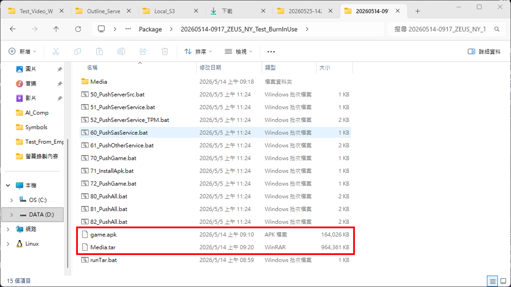
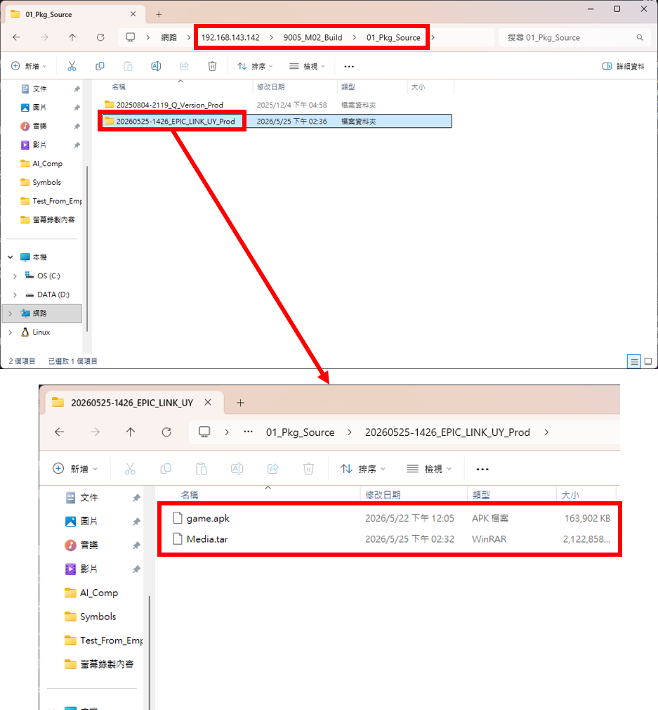
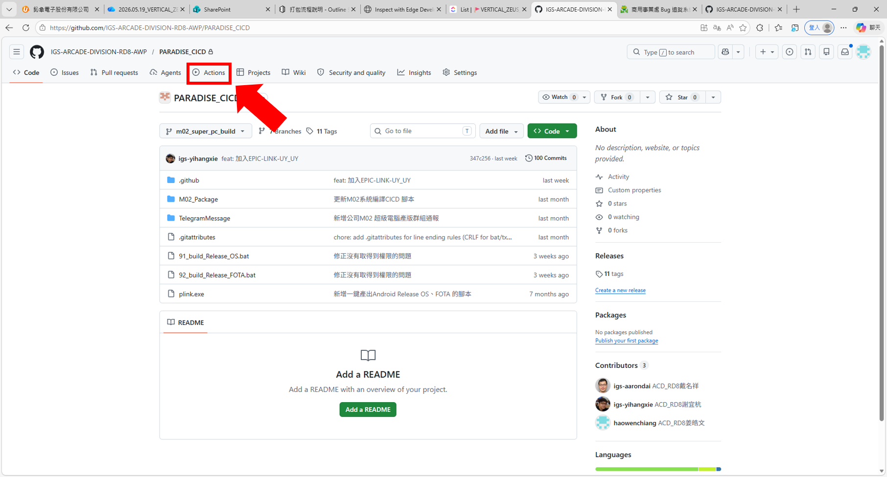
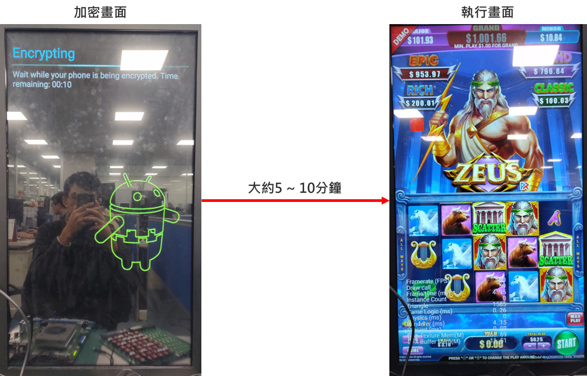

# M02 打包與產品板更新流程

## 摘要

本頁說明 microchip M02 從資源準備、GitHub Actions 打包、OS／FOTA 產物取得、產品板燒錄，到製作 FOTA 更新碟與執行產品板更新的完整流程。

## 適用範圍

- 專案／產品：microchip M02
- 產品板：M02；PR 版初始啟動另有自動加密流程
- CI/CD：`PARADISE_CICD`
- 引擎：不適用

## 前置條件

打包前必須先取得：

- APK 檔案
- `Media.tar` 多媒體資源壓縮檔

資源產出流程目前尚未補上正式連結，請參考「待確認事項」。



## 1. 上傳打包來源檔案

在下列網路路徑建立一個資料夾：

```text
\\192.168.143.142\9005_M02_Build\01_Pkg_Source
```

將 APK 與 `Media.tar` 放入該資料夾。資料夾名稱可使用產出資源後的輸出資料夾名稱。



## 2. 執行 GitHub Actions 打包

CI/CD Repository：[PARADISE_CICD](https://github.com/IGS-ARCADE-DIVISION-RD8-AWP/PARADISE_CICD)

1. 進入 Repository 的 **Actions** 頁籤。
2. 選擇 `01.Build Release OS (產出 OS 及 FOTA 更新包)`。
3. 按下 **Run workflow**。
4. 填寫以下參數：

| 欄位 | 填寫方式 |
| --- | --- |
| 資料夾名稱 | `01_Pkg_Source` 下的來源資料夾名稱 |
| 是否要更新 Git | 勾選 |
| 產出的版本 | `PD_REL` |
| 機種名稱 | 選擇對應的機種，例如 `EPIC-LINK_US` |
| 指定 Runner | ⚠️ 目前勿修改 |

確認參數後按 **Run workflow** 開始打包。




## 3. 取得 OS 與 FOTA 產物

| 產出物 | 路徑 |
| --- | --- |
| OS（燒錄用） | `\\192.168.143.142\9005_M02_Build\02_Release` |
| FOTA（更新碟用） | `\\192.168.143.142\9005_M02_Build\02_Release\FOTA` |

輸出資料夾格式為：

```text
(日期_時間)_機種名稱
```

例如：`(20260515_1954)_EPIC-LINK-MO_US`

⚠️ OS 輸出資料夾中的 `_AGENTONLY` 壓縮檔不可使用，請選擇檔名結尾沒有 `_AGENTONLY` 的壓縮檔。

## 4. 燒錄產品板

OS 壓縮檔需要解壓縮兩次：

1. 第一次解壓縮取得 `OS.zip`。
2. 第二次解壓縮 `OS.zip`，取得實際燒錄檔案。

後續燒錄方式與開發板燒錄流程相同。開發板燒錄詳細文件目前尚未補上，請見「待確認事項」。

## 5. PR 版首次啟動

產品板第一次啟動會進行自動加密：

- 畫面會顯示 `Encrypting`。
- 約需 5–10 分鐘，期間可能是黑畫面。
- 加密期間嚴禁斷電。
- 加密完成後會自動開啟 APK，不需手動設定自動啟動項目。

### 機種名稱不符

若出現：

```text
Upboard status : Failed
PROJECT : [機種名稱]?
```

代表 OS 名稱與產品板內部機種名稱不一致。請確認機種代號，重新燒錄名稱完全相符的 OS。



## 6. 製作 FOTA 更新碟

FOTA 內的 `out_otaupdate` 資料夾包含三個檔案。將它們複製到 FOTA 根目錄後，刪除 `out_otaupdate` 資料夾：

```text
FOTA 輸出資料夾/
├── info.txt
├── proj_name.txt
├── system_info.txt
├── system_update.zip
└── update.zip
```

將這五個檔案複製到隨身碟，即可作為更新碟。

## 7. 執行產品板更新

1. 關閉產品板電源。
2. 插入更新碟。
3. 重新上電，等待自動更新。
4. 監控進度直到 100%。
5. 若畫面顯示以下訊息，拔除隨身碟並重新開機：

```text
Same version.
Please make sure USB drive is unplugged, then reboot the machine again.
```

## 待確認事項

- ⚠️ 資源產出流程的正式文件連結。
- ⚠️ 開發板燒錄詳細流程的正式文件連結。
- ⚠️ 輸出範例中的 `EPIC-LINK-MO_US` 是否應為 `EPIC-LINK-M02_US`。
- ⚠️ `是否要更新 Git` 實際更新的 Repository 與分支。

## 參考資料

- [Outline 原頁：M02 打包流程說明](https://outline01.igsgame.com/doc/m02-ltq34UZl8Y)
- [PARADISE_CICD](https://github.com/IGS-ARCADE-DIVISION-RD8-AWP/PARADISE_CICD)
- Raw：[M02 打包流程說明（Outline 匯入）](../raw/01_Architecture-and-Development/M02/2026/08/m02-packaging-process-outline.md)

## 關聯頁面

- 相關：待補 M02 開發板燒錄流程
- 取代：無
- 衝突：無
