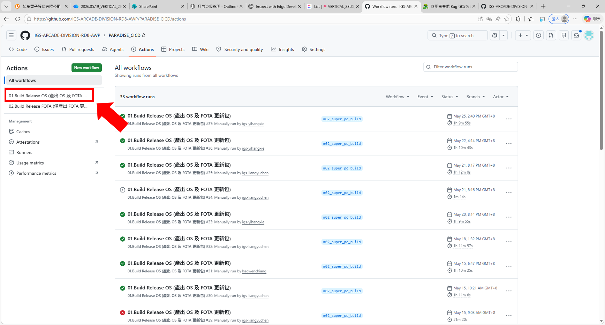
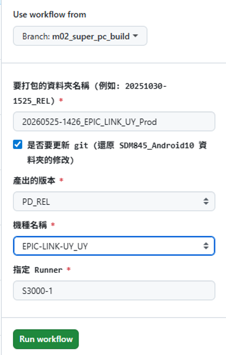

# M02 打包流程說明（原始整理）

## 來源

- Outline 原頁：[M02 打包流程說明](https://outline01.igsgame.com/doc/m02-ltq34UZl8Y)
- Outline 頁面標示：`status: imported`
- 原頁最後更新：2026-05-26

## 原始內容摘要

這份文件說明 microchip M02 從資源產出、GitHub Actions 打包、OS／FOTA 產物取得、產品板燒錄，到 FOTA 更新碟製作與產品板更新的操作流程。

## 原始步驟

### 0. 產出資源

打包前先產出：

- APK 檔案：應用程式安裝包
- `Media.tar`：多媒體資源壓縮檔

原頁附有產出資源後的輸出資料夾截圖。資源產出流程的連結目前仍是 TODO。


### 1. 上傳檔案

在下列網路路徑建立資料夾，並放入 APK 與 Media 檔案：

```text
\\192.168.143.142\9005_M02_Build\01_Pkg_Source
```

資料夾名稱可使用產出資源後的輸出資料夾名稱。


### 2. GitHub Actions 打包

CI/CD Repository：

[IGS-ARCADE-DIVISION-RD8-AWP/PARADISE_CICD](https://github.com/IGS-ARCADE-DIVISION-RD8-AWP/PARADISE_CICD)

操作：

1. 進入 GitHub Repository 的 **Actions**。
2. 選擇 `01.Build Release OS (產出 OS 及 FOTA 更新包)`。
3. 按下 **Run workflow**。
4. 填寫資料夾名稱、是否更新 Git、產出版本、機種名稱與指定 Runner。
5. 指定 Runner 目前勿修改。

參數：

| 欄位 | 填寫方式 |
| --- | --- |
| 資料夾名稱 | 步驟 1 在 `01_Pkg_Source` 建立的資料夾名稱 |
| 是否要更新 Git | 勾選 |
| 產出的版本 | 選擇 `PD_REL` |
| 機種名稱 | 選擇對應機種，例如 `EPIC-LINK_US` |
| 指定 Runner | 後續功能，目前勿修改 |






### 3. 打包產出

| 產出物 | 路徑 |
| --- | --- |
| OS（燒錄用） | `\\192.168.143.142\9005_M02_Build\02_Release` |
| FOTA（更新碟用） | `\\192.168.143.142\9005_M02_Build\02_Release\FOTA` |

輸出資料夾格式：

```text
(日期_時間)_機種名稱
```

範例：`(20260515_1954)_EPIC-LINK-MO_US`

OS 輸出資料夾有兩個壓縮檔，其中檔名結尾為 `_AGENTONLY` 的檔案不可使用，必須使用沒有 `_AGENTONLY` 的檔案。

### 4. 硬體燒錄

取得 OS 壓縮檔後解壓縮兩次：

1. 第一次解壓縮得到 `OS.zip`。
2. 第二次解壓縮 `OS.zip`，取得可燒錄到產品板的檔案。

後續燒錄流程與開發板燒錄流程相同；燒錄檔案選擇第二次解壓縮後的資料夾。詳細開發板燒錄連結目前仍是 TODO。

### 5. 產品板初始啟動

PR 版產品板燒錄後首次啟動會執行自動加密：

- 會進入 `Encrypting` 畫面。
- 約需 5–10 分鐘，期間可能是黑畫面。
- 加密期間嚴禁斷電。
- 加密完成後會自動開啟 APK，不需手動設定自動啟動項目。

若顯示 `Upboard status : Failed` 並出現 `PROJECT : [機種名稱]?`，代表 OS 名稱與產品板內部機種名稱不一致；必須確認機種代號並重新燒錄完全相符的 OS。


### 6. FOTA 更新碟

FOTA 原始結構：

```text
FOTA 輸出資料夾/
├── out_otaupdate/
│   ├── proj_name.txt
│   ├── system_info.txt
│   └── system_update.zip
├── info.txt
├── proj_name.txt
└── update.zip
```

將 `out_otaupdate` 內的三個檔案複製到外層，並刪除 `out_otaupdate` 資料夾，最後應為：

```text
FOTA 輸出資料夾/
├── info.txt
├── proj_name.txt
├── system_info.txt
├── system_update.zip
└── update.zip
```

將以上五個檔案複製到隨身碟，即可作為更新碟。

### 7. 產品板更新

1. 關閉產品板電源。
2. 插入更新碟。
3. 重新上電，等待系統自動更新。
4. 監控進度至 100%。
5. 若顯示以下訊息，拔除隨身碟後重新開機：

```text
Same version.
Please make sure USB drive is unplugged, then reboot the machine again.
```

## 待確認

- ⚠️ 補上資源產出流程文件連結。
- ⚠️ 補上開發板燒錄詳細流程連結。
- ⚠️ 確認輸出範例中的 `EPIC-LINK-MO_US` 是否應為 `EPIC-LINK-M02_US`。
- ⚠️ 確認 `是否要更新 git` 勾選後實際更新的 Repository 與分支。
